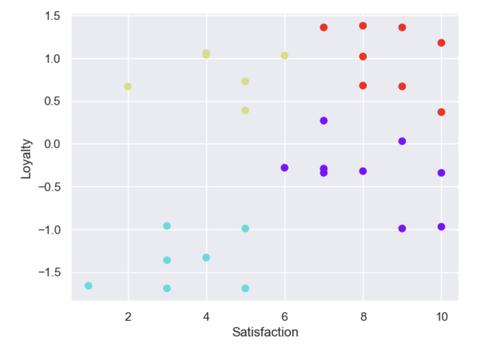

# K-Means Clustering: Customer Loyalty & Satisfaction Analysis

## Overview
This project applies **K-Means clustering** to explore patterns in customer loyalty and satisfaction. The objective was to segment customers into meaningful groups to gain insights into their behaviors and preferences.

## Dataset & Preprocessing
- **Customer Loyalty**: This variable was already standardized (Mean = 0, SD = 1), so no further transformation was needed.
- **Customer Satisfaction**: Standardized to ensure comparability.

## Methodology
1. **Feature Standardization**:
   - Loyalty remained unchanged due to its standardized nature.
   - Satisfaction was standardized using `StandardScaler` from `sklearn`.
2. **Optimal Cluster Selection**:
   - The **Within-Cluster Sum of Squares (WCSS)** was evaluated for different cluster sizes.
   - A significant drop in WCSS was observed at **k = 4** (WCSS = 4.1), leading to the selection of **4 clusters**.
3. **K-Means Clustering**:
   - The K-Means algorithm was applied with `n_clusters=4`.
   - Centroids and cluster labels were extracted.

## Results & Insights
- Customers were segmented into four clusters based on satisfaction and loyalty levels.
- These clusters provide insights into customer behavior, helping businesses tailor engagement strategies.

## Visualization
The clusters were visualized using a **scatter plot**, where colors represent different clusters.
](https://github.com/MbaliMabaso/ClusterAnalysis-of-Customer-loyalty-and-satisfaction/blob/c118a0f0e123fc424f50ebf87a7c0d9a0061c64f/CustomerLoyaltyandSatisfactionClusters.png)



## How to Run the Analysis
```python
# Install dependencies
pip install numpy pandas matplotlib scikit-learn

# Run the analysis
python kmeans_analysis.py
```

## Dependencies
- Python 3.x
- NumPy
- Pandas
- Matplotlib
- Scikit-learn

## Future Improvements
- Incorporate additional features (e.g., customer demographics, transaction history) to refine clustering.


---
Feel free to contribute or suggest improvements!
