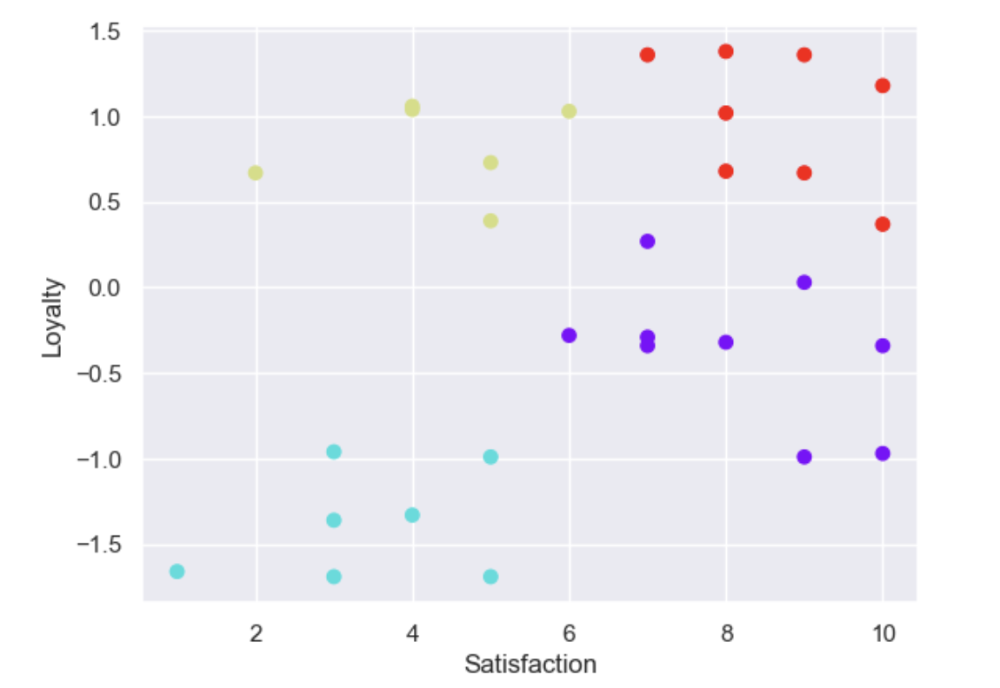

# Cluster Analysis Report

## Objective
The goal of this analysis was to identify distinct customer segments based on their loyalty and satisfaction levels using K-Means clustering. This segmentation helps to uncover patterns in customer behavior, providing valuable insights for strategic decision-making.

## Methodology
### Data Preprocessing
- **Customer Loyalty**: This variable was already standardized with a mean of 0 and standard deviation of 1. No further transformation was required.
- **Customer Satisfaction**: Standardized using `StandardScaler` to ensure comparability with the loyalty variable.

### Clustering Algorithm
1. **K-Means Clustering**:
   - The optimal number of clusters was determined by analyzing the Within-Cluster Sum of Squares (WCSS).
   - The WCSS values for increasing cluster counts showed a significant drop at 4 clusters (WCSS = 4.1), indicating that **4 clusters** best fit the data.
2. **Cluster Formation**:
   - K-Means was implemented with `n_clusters=4`.
   - Centroids and cluster labels were computed.

### Visualization
The resulting clusters were visualized using a scatter plot:
- **Axes**:
  - X-axis: Customer Satisfaction
  - Y-axis: Customer Loyalty
- **Colors**:
  - Each cluster is represented by a unique color.
  - Cluster centroids were highlighted to indicate the cluster centers.

### Key Visual Insights
- Four distinct clusters are observed:
  - High loyalty, high satisfaction (e.g., red cluster)
  - Moderate satisfaction with varying loyalty levels (e.g., yellow cluster)
  - Low loyalty, moderate satisfaction (e.g., cyan cluster)
  - Mixed satisfaction and loyalty (e.g., purple cluster)

## Results
The 4 identified clusters reveal the following patterns:
1. **Cluster 1 (Red)**: Customers with high satisfaction and high loyalty. Likely the most valuable segment for retention.
2. **Cluster 2 (Yellow)**: Customers with moderate satisfaction but mixed loyalty levels. Engagement strategies could improve loyalty here.
3. **Cluster 3 (Cyan)**: Low loyalty and moderate satisfaction. Focused efforts are needed to understand and address dissatisfaction.
4. **Cluster 4 (Purple)**: Customers with mixed loyalty and satisfaction levels. Strategies should address specific needs in this segment.

## Recommendations
- **Cluster-Specific Strategies**:
  - Focus on retaining high-loyalty customers by rewarding their loyalty and addressing potential pain points.
  - Improve satisfaction levels in clusters with moderate satisfaction to increase loyalty.
- **Future Analysis**:
  - Incorporate demographic and transactional data to refine segmentation.
  - Evaluate the impact of targeted strategies using metrics like Net Promoter Score (NPS) or Customer Lifetime Value (CLV).

## Conclusion
This analysis successfully segmented customers into 4 clusters based on loyalty and satisfaction. These insights can inform targeted engagement strategies, improving overall customer experience and business outcomes.

